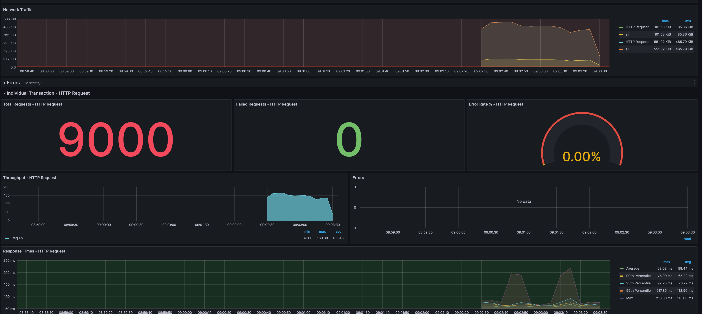

# Introduction

Welcome to the jmeter-grafana repository!

This repository provides a grafana dashboard for real time monitoring of a jmeter test.




## Pre-requisites

* x86 architecture (YMMV on a M1 macbook)
* bash shell (windows users should use WSL to run the instructions below from a `bash` prompt)
* docker and jq installed

## Run the example test

```sh
#build a jmeter image with the required configuration
docker build . -f ./Dockerfile.jmeter -t jmeter:local
#start the stack
docker compose up -d --wait
#create the admin user within influxdb
./init_influxdb.sh
#create an API token within grafana
./init_grafana.sh
#run jmeter with the example jmx 
./run.sh example
```
* the standard output from the `run.sh` command will print a URL, copy it to clipboard
* navigate to this URL in a browser
* login to grafana with user `admin` password `admin`
* skip the step to update the admin password by clicking `Skip`, and enjoy the dashboard!
* html reports written to the [report subfolder](/report/)
* a .png image of the scatterplot widget is saved to disk, can be uploaded as build artifact
* statistics `total transactions`, `error rate`, `p(99)`, and `mean duration` are exposed as shell variables for automated test result determination wtihin a ci/cd pipeline

## Run your own test

* Place your .jmx file in the [jmx subfolder](/jmx)
* For the dashboard to work, each Thread Group in the test must have the same `InfluxDB Listener` and `Simple Data Writer` as the [example.jmx](/jmx/example.jmx)
* The [run.sh script](/run.sh) takes a single parameter, the jmx filename without the `.jmx` extension.
For example, the following works if you placed mytest.jmx within the jmx folder:

```sh
./run.sh mytest
```

## Stop the stack

```sh
docker-compose down
```
The containers can be stopped when not in use. The influxdb and grafana state is maintained in the volume mounts [storage-influx](/storage-influx/) and [storage-grafana](/storage-grafana/), so that test results will not be lost when the stack is stopped.  
To restart the stack another day and run another test, the init steps are skipped:
```sh
docker compose up -d --wait
./run.sh example
```
